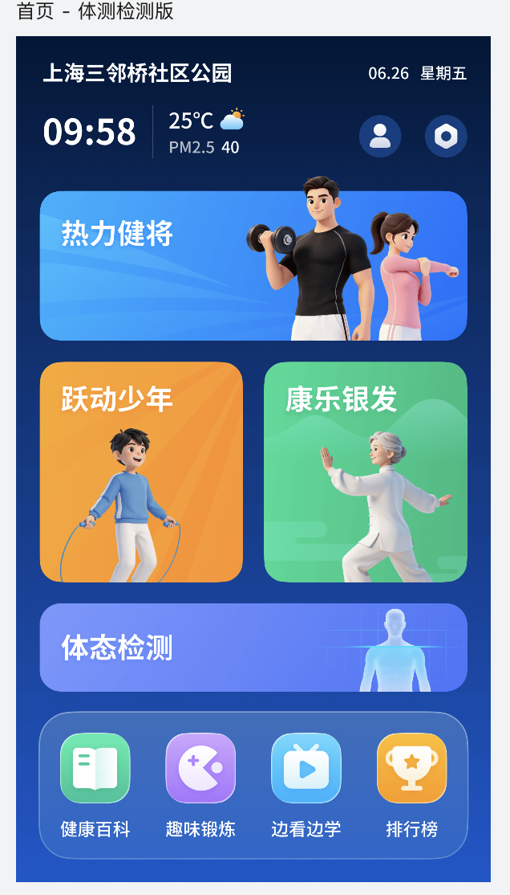
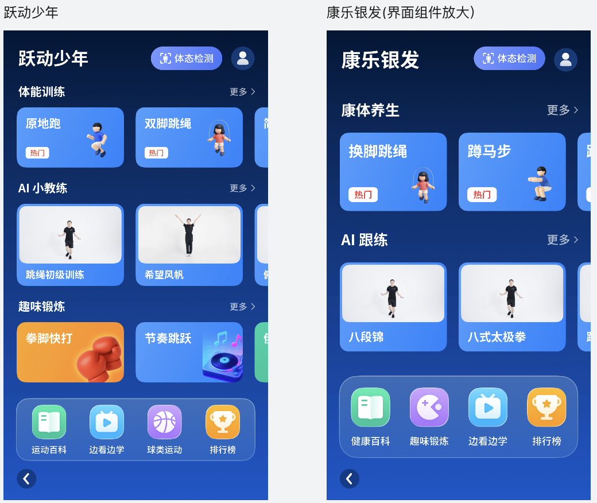
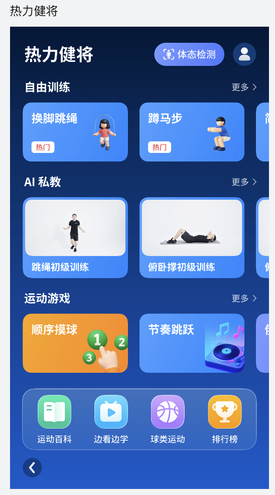

# FitForAll AI · AI 全民健身机

以计算机视觉识别人物运动，连接立式触摸大屏设备、Web 管理后台和手机端小程序的全民健身产品。

**当前产品版本：v1.0（包含体态检测功能）。** 本仓库目前建立产品需求与设计资料基线，用于后续需求梳理、原型和 Demo 迭代；尚未收录设备应用、算法、后台或小程序的实现代码。产品版本不代表仓库已有可运行的软件发行版。

## 产品形态

| 端 | 已确认的信息 | 待补充 |
| --- | --- | --- |
| 设备端 | 带摄像头的立式触摸大屏；9:16，例如 43 寸；计算机视觉识别屏幕前人物运动 | 操作系统、实际分辨率、硬件规格、识别接口与完整交互规则 |
| Web 管理后台 | 产品包含配套管理后台 | 角色、功能模块、配置范围、数据权限 |
| 手机端小程序 | 产品包含配套小程序 | 平台、用户流程、登录与设备关联、数据联动 |

设备首页按热力健将、跃动少年、康乐银发组织人群入口。v1.0 首页增加独立的体态检测入口，热力健将、跃动少年、康乐银发三个人群页均展示体态检测快捷入口。检测指标和内部流程尚待产品经理补充。

## 从这里开始

| 文档 | 用途 |
| --- | --- |
| [产品基线](PRODUCT_BASELINE.md) | v1.0 已知事实、页面结构与证据边界 |
| [界面参考](DESIGN_REFERENCES.md) | 最新原图、版本适用范围与设计约束 |
| [待确认事项](OPEN_QUESTIONS.md) | 按具体功能逐步补齐的信息 |
| [需求模板](PRD_TEMPLATE.md) | 从场景、规则到验收标准的需求写作模板 |
| [原型与 Demo 约定](PROTOTYPE_GUIDE.md) | 原型交付、模拟能力标注与验证方式 |
| [协作指南](CONTRIBUTING.md) | 提需求、记录决策、提交变更的工作方式 |
| [版本记录](CHANGELOG.md) | 已确认的产品版本变化 |

## v1.0 界面

以上为产品经理提供的参考截图，非仓库运行截图。场地、日期、天气与课程封面等展示内容不作为部署参数或实时数据。

## 后续迭代

每次围绕一个具体功能，依次补充需求、原型、交互 Demo 和验收结果。未确认的技术栈、算法指标、排期和跨端能力保留为待确认项。当前无需安装依赖，可直接阅读 Markdown 文档；可运行 Demo 的启动方法在对应 Demo 创建后提供。
